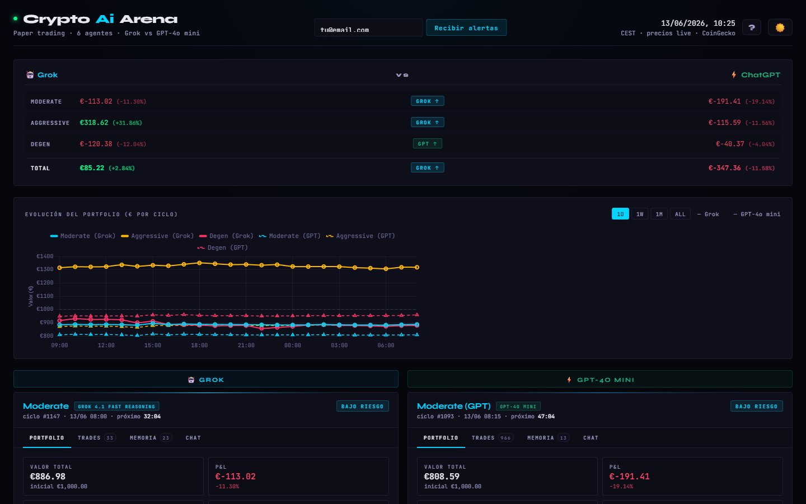

# AI Investor 🤖📈

Crypto paper trading with 6 autonomous LLM agents, split into 2 teams competing against each other under the **exact same strategy**: one team runs on Grok (xAI), the other on GPT-4o mini (OpenAI). Goal: compare which model makes better trading decisions under identical conditions.

Live public dashboard: **[cryptoaiarena.com](https://cryptoaiarena.com)**



## How it works

Each agent starts with **€1000 in fake capital** and, on every cycle, gets a snapshot of the market (prices, RSI, funding rates, Fear & Greed Index, news, macro context) and decides to buy, sell, or hold. Everything is logged to JSON — no real money involved.

There are 3 risk profiles, each running twice (one model per team):

| Profile | Strategy | Grok | GPT |
|---|---|---|---|
| **Moderate** | Conservative, top 10 coins, max 25% per position | ✅ | ✅ |
| **Aggressive** | Aggressive, top 50 coins, max 40% per position | ✅ | ✅ |
| **Degen** | High concentration, FOMO allowed, 10x or bust | ✅ | ✅ |

Each agent keeps its own portfolio, trade history, and persistent memory (it learns from its own past decisions between cycles).

## Data sources

- **CoinGecko** — prices, market cap, RSI, trending
- **Alternative.me** — Fear & Greed Index
- **Binance Futures** — funding rates
- **Yahoo Finance** — DXY and S&P 500 (macro context)
- **Coindesk + Cointelegraph** — news via RSS

## Stack

- Python — agent logic, data fetching, dashboard generation
- xAI SDK (Grok 4.1 fast reasoning) + OpenAI Responses API (GPT-4o mini) — trading decisions
- Static HTML/JS — dashboard, no frontend framework
- Cron — runs each agent on its own hourly cycle

## Structure

```
agent.py              # buy/sell/hold decision logic per agent
data.py                # market, news and macro data fetches
run_once.py             # runs one trading cycle for a given profile
generate_report.py      # generates the HTML dashboard
api_server.py            # HTTP API — chat with the agents
memory.py               # persistent memory per agent
portfolio.py            # portfolio CRUD (JSON)
profiles.py              # definition of the 6 agents and their system prompts
notifier.py / daily_digest.py   # subscriber emails (Resend)
bluesky_bot.py / twitter_bot.py # automated result posting
```

## Running it locally

```bash
git clone https://github.com/DemboNauta/ai-investor.git
cd ai-investor
pip install -r requirements.txt
cp .env.example .env   # fill in your API keys (xAI, OpenAI...)
```

Run a single cycle for one agent:

```bash
python run_once.py moderate
```

Regenerate the dashboard:

```bash
python generate_report.py
```

See [`docs/adding-a-provider.md`](docs/adding-a-provider.md) to add a new model/provider.

## Disclaimer

Paper trading only. No agent moves real money or executes trades on any exchange. Nothing here is financial advice.
